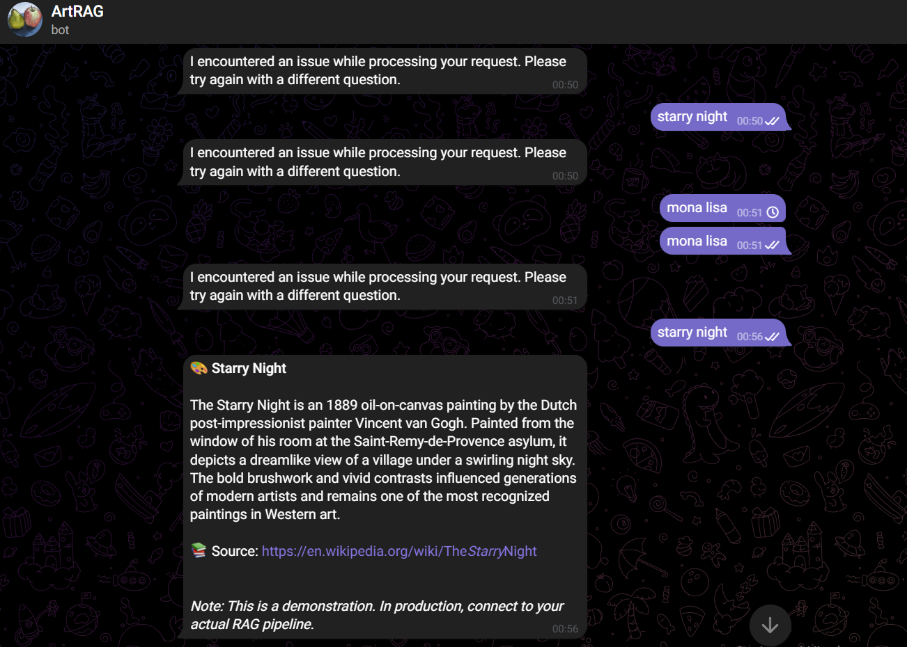

# Art RAG

Ассистент, который отвечает на вопросы о произведениях искусства и художниках на основе данных из Википедии.

## Быстрый старт
1) Требования: Python 3.10+, `pip install datasets`.
2) Собрать сэмпл данных:  
   `python scripts/fetch_wikipedia_art_sample.py`
3) После выполнения в `data/` появятся сырые данные и чанки, готовые к индексации (Faiss/LangChain).

## Стек
- LangChain / Faiss (векторное хранилище, следующий этап)
- Streamlit / aiogram (интерфейс, следующий этап)
- Hugging Face `legacy-datasets/wikipedia` (исходный датасет)

## Структура репозитория
- `scripts/fetch_wikipedia_art_sample.py` — сбор, фильтрация и чанкинг сэмпла.
- `data/raw/` — сырые выгрузки (`wikipedia_art_sample.jsonl`).
- `data/processed/` — подготовленные чанки (`chunks_sample.jsonl`).
- `CHECKPOINT1_REPORT.md` — отчет по чекпоинту «Сбор данных».

## Как работает пайплайн данных
- Источник: Википедия (`legacy-datasets/wikipedia`, дамп `20220301.en`), фильтрация по ключевым словам об искусстве.
- Сырые статьи сохраняются в JSONL: `id`, `title`, `source_url`, `text`.
- Чанкинг по длине (~400–500 символов) без перекрытий; сохраняются `doc_id`, `chunk_id`, `content`, `source_url`.

## Дальнейшие шаги
- Расширить выгрузку (больше статей и языков), автоматизировать обновления.
- Добавить расчет эмбеддингов и индекс в `data/index/`.
- Собрать интерфейс (Streamlit / Telegram) и интегрировать поисковый стек.

# Telegram-бот

